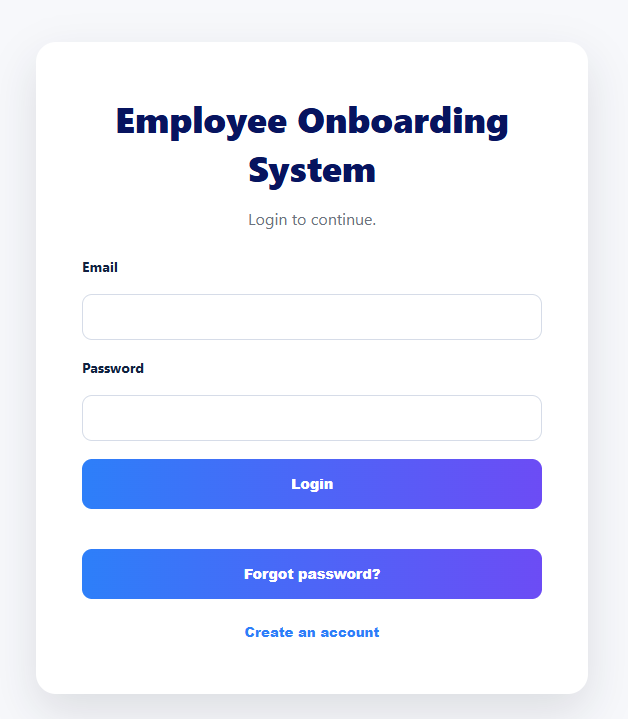
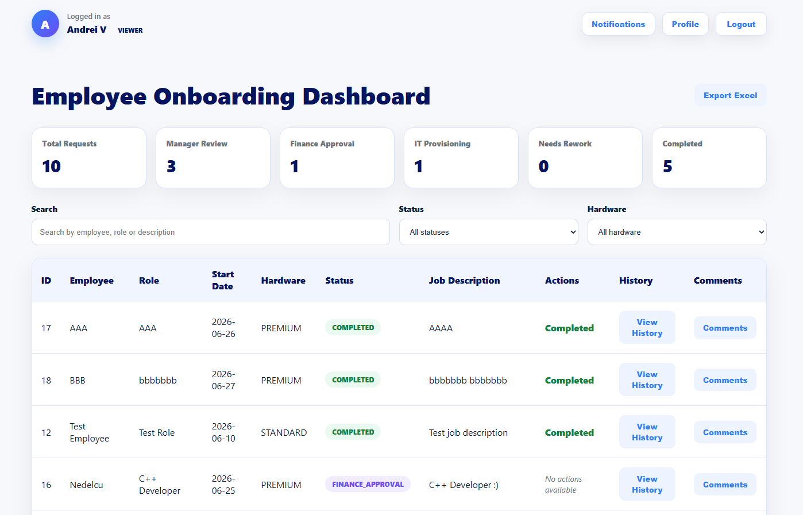
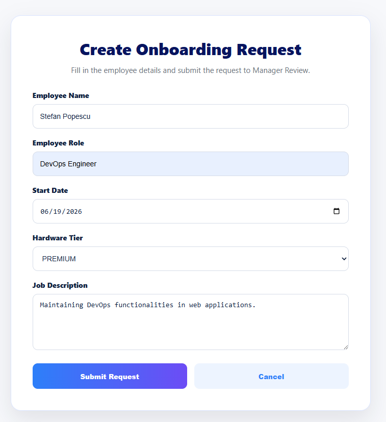
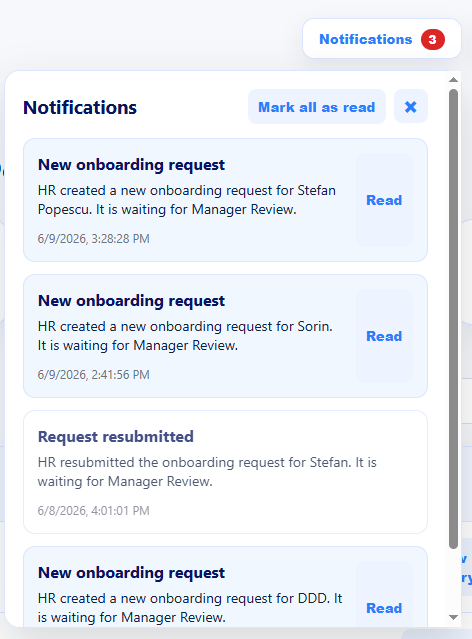
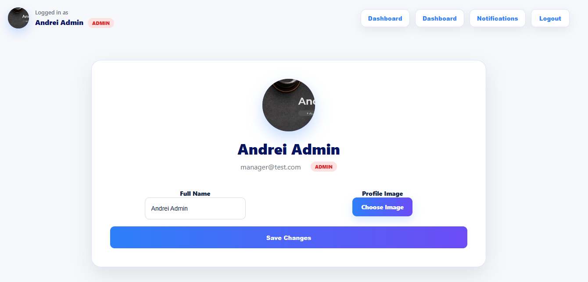
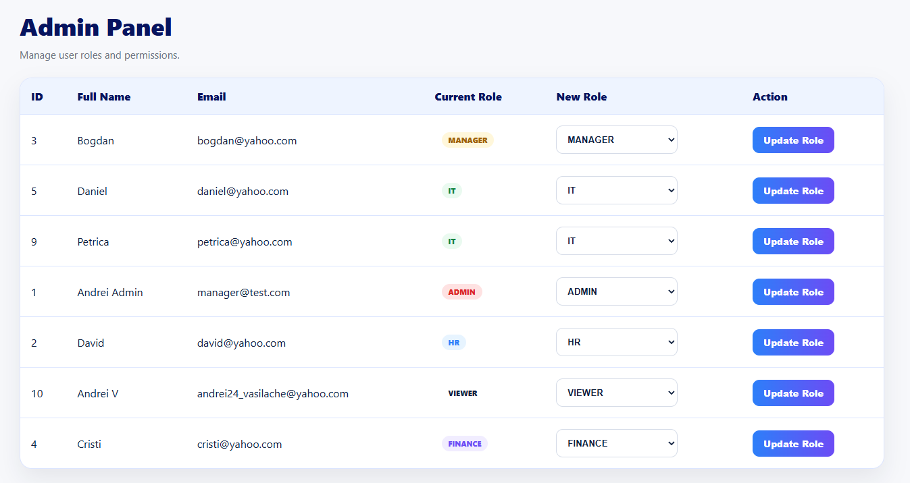
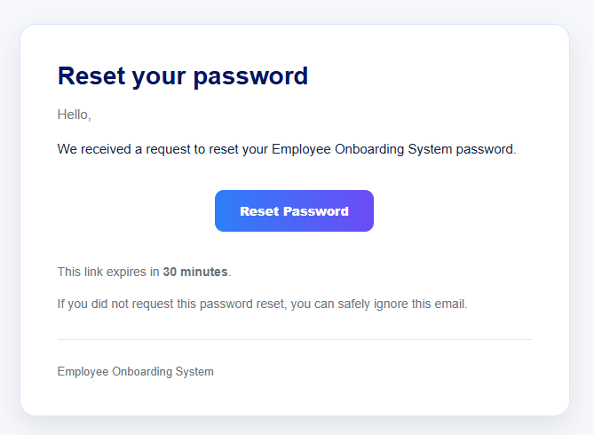
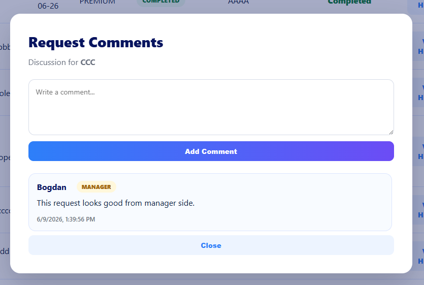
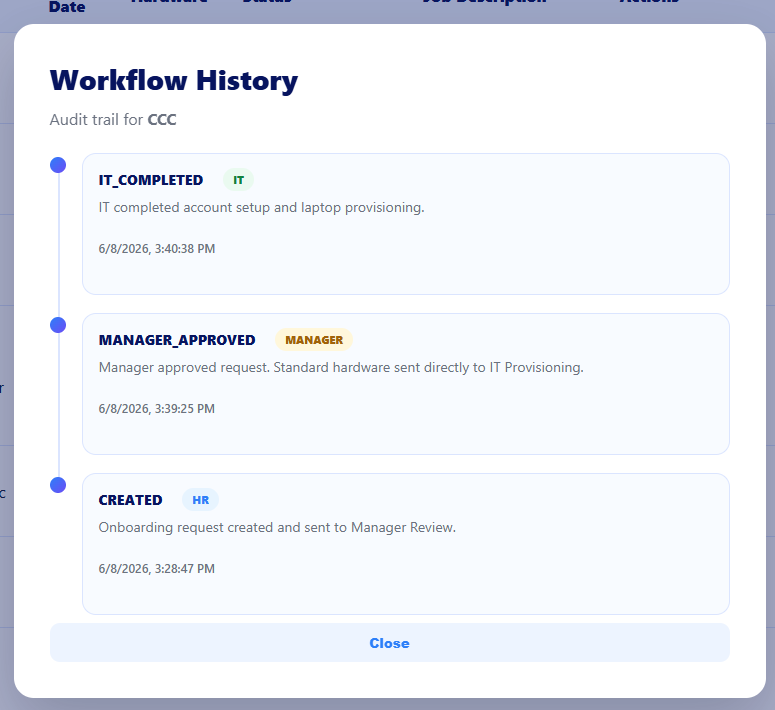

# Employee Onboarding System

A full-stack Employee Onboarding Management platform built with Spring Boot, React, PostgreSQL, and JWT Authentication.

The application automates the employee onboarding workflow between HR, Manager, Finance, and IT departments, providing request tracking, approvals, notifications, comments, profile management, workflow history, reporting, and secure authentication.

> Designed and developed a complete enterprise onboarding workflow platform with role-based approvals, JWT security, email-based password recovery, notifications, comments, profile management, workflow tracking, and reporting capabilities.

---

# Features

## Authentication & Security

- User Registration
- User Login
- JWT Authentication
- Forgot Password via Email
- Password Reset via Secure Token
- Role-Based Access Control (RBAC)
- Protected API Endpoints
- Profile Management
- Profile Picture Upload

## User Roles

The system supports multiple organizational roles:

- ADMIN
- HR
- MANAGER
- FINANCE
- IT
- VIEWER

Each role has access only to the actions relevant to its responsibilities.

## Employee Onboarding Workflow

- Create onboarding requests
- Multi-step approval workflow
- Manager approval stage
- Finance approval stage
- IT provisioning stage
- Request rejection
- Request resubmission
- Request completion
- Complete onboarding history
- Audit trail of workflow actions

## Notifications

- Role-based notifications
- Unread notification counter
- Mark individual notifications as read
- Mark all notifications as read
- Real-time workflow updates

## Collaboration

### Comments Per Request

- Jira-style comments
- Request discussions
- Author tracking
- Timestamp tracking
- Historical comment visibility

## Profile Management

- View user profile
- Update profile information
- Upload profile picture
- Persistent profile image after login/logout
- Avatar displayed throughout the application

## Reporting & Analytics

### Dashboard Statistics

- Total Requests
- Manager Reviews
- Finance Approvals
- IT Provisioning Requests
- Completed Requests
- Rework Requests
- Hardware Distribution Statistics

### Export

- Excel Export (.xlsx)
- Download onboarding request reports

---

# Technology Stack

## Backend

- Java 21
- Spring Boot
- Spring Security
- JWT Authentication
- Hibernate / JPA
- PostgreSQL
- Maven
- Mailtrap (Email Integration)

### Main Backend Modules

- Authentication
- User Management
- Onboarding Workflow
- Notifications
- Profile Management
- Comments
- Reporting
- Workflow History
- Password Recovery

## Frontend

- React
- TypeScript
- Axios
- CSS
- Vite

### Frontend Features

- Responsive Dashboard
- Role-Based UI
- Notifications Center
- Profile Page
- Admin Panel
- Forgot Password Flow
- Workflow History View
- Excel Export

---

# Screenshots

## Login



---

## Dashboard



---

## Create Request



---

## Notifications



---

## Profile Page



---

## Admin Panel



---

## Forgot Password



---

## Comments



---

## Workflow History

Track the complete lifecycle of every onboarding request, including approvals, rejections, resubmissions, and status changes performed by different departments.



---

# Workflow Overview

```text
HR
 │
 ▼
Manager Review
 │
 ▼
Finance Approval
 │
 ▼
IT Provisioning
 │
 ▼
Completed
```

Rejected requests can be resubmitted and reviewed again.

---

# Workflow Tracking & Audit Trail

Every action performed on an onboarding request is automatically recorded:

- Request Created
- Manager Approved
- Manager Rejected
- Finance Approved
- Finance Rejected
- IT Provisioning Completed
- Request Resubmitted
- Status Changes

This provides:

- Full traceability
- Auditability
- Workflow transparency
- Department accountability

---

# Database Structure

Main entities:

- User
- OnboardingRequest
- OnboardingHistory
- Notification
- OnboardingComment
- PasswordResetToken

The **OnboardingHistory** entity provides a complete audit trail for every workflow transition and user action performed during the onboarding process.

---

# Installation

## Clone Repository

```bash
git clone https://github.com/andreivas24/<repository-name>.git
```

## Backend Setup

```bash
cd backend

mvn clean install
mvn spring-boot:run
```

Backend runs on:

```text
http://localhost:8080
```

## Frontend Setup

```bash
cd frontend

npm install
npm run dev
```

Frontend runs on:

```text
http://localhost:5173
```

---

# Environment Variables

Example configuration:

```properties
# JWT
JWT_SECRET=your-secret-key

# Mailtrap
MAIL_HOST=sandbox.smtp.mailtrap.io
MAIL_PORT=2525
MAIL_USERNAME=your-username
MAIL_PASSWORD=your-password
```

---

# Security Features

- JWT Authentication
- Password Hashing (BCrypt)
- Secure Password Reset Tokens
- Role-Based Authorization
- Protected API Endpoints
- Secure File Upload Handling

---

# Future Improvements

- PDF Export
- Advanced Dashboard Charts
- Email Notifications
- User Activity Logs
- Request Attachments
- Docker Deployment
- CI/CD Pipeline

---

# Author

**Andrei Vasilache**

GitHub:  
https://github.com/andreivas24
